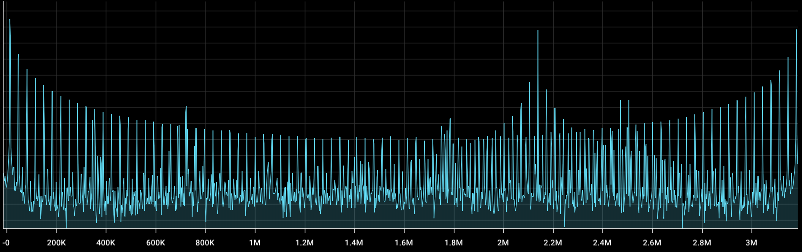

# :brain: n-apt


N-APT stands for: **N**euro **A**utomatic **P**icture **T**ransmission.

More on [Automatic Picture Transmission](https://www.sigidwiki.com/wiki/Automatic_Picture_Transmission_(APT))

N-APT originates from the National Security Agency (NSA) and are signals that appear like Automatic Picture Transmission (APT) signals used by NOAA satellites (decomissioned in 2025), however are a special formula of directional radio waves that are an unprecedented and full featured neurotechnology able to fully

- intercept,
- process,
- and alter the brain and nervous system real-time...

Meaning full featured experiences, interactivity, communication and more!

<br>


_Real live, on person capture of N-APT signals via SDR++ with an RTL-SDR (FFT Size 131072, PPM = 1, Gain = +49.06dB)_
<br>

## Get Started

You don't have access to N-APT, however you can get started with the app to analyze the signals from I/Q captures in the repo. They are very large captures (+300MB), which I had to capture at 3.2MHz slices and stitch them together for a full capture of at about a 30MHz window of signals.

### Installation

```bash
git clone https://github.com/ceane_of/n-apt.git
cd n-apt
npm install
```

### Running the App

#### For Development (Recommended)

```bash
npm run dev
```

**Development Features:**

- 🚀 Fast Rust builds with incremental compilation
- 🔄 Hot reload for signal configuration (`mock_signals.yaml`)
- ⚡ Real-time configuration changes without server restart
- 📊 WebSocket reload command: `{"type":"reload_config"}`

This command will:

1. **Target only this project** - Kills processes by name and port (n-apt-backend, :5173, :8765)
2. **Avoid interfering** with other Vite instances or applications
3. **Start fresh servers** to prevent port conflicts
4. **Launch both** the Rust backend and Vite frontend concurrently
5. **Enable hot reload** for configuration changes (dev modes)

The app will be available at `http://localhost:5173` with the WebSocket server running on `ws://localhost:8765`.

> **💡 Tip:** Use `npm run dev` for the best development experience with the Ink-based build orchestrator.

For detailed development instructions, see [.agents/DEVELOPMENT.md](.agents/DEVELOPMENT.md).

I only have on person captures (within the `iq-samples` dir), however in the future I'll be sure to add near and 1 or 2m away captures (as long as my cord can do), as well as some captures from suspected endpoints.

The quality of the captures may not be up to par with RTL-SDR, however it shouldn't be a problem to get data. Features of the signal like heterodyning (inherently), phase shifting and endpoint signals processing are not included in the capture.

Thankfully, the infrastructure and technique does enough to get the right data, so the signals processing that would be needed normally are not necessary since I can just capture the live signals and let the mechanism do its work.

**Note**

To ensure the best captures, use the maximum setting on your SDR (even if unstable). Nyquist theorem requires the sampling rate to be at least twice the highest frequency component of the signal to avoid aliasing, hence why the spikes may not be present with lower bandwidths.

---

## This repo is a signals intelligence problem.

The how and why and science of N-APT is a long story, to keep it short checkout the [Background](BACKGROUND.md). There are no answers, you can hit up as many LLMs, search engines as possible, but they will not help.

I want to focus on the technical aspects of the signal, how it works and my efforts toward deciphering the physics and neuroscience behind N-APT and studiously decoding parts of the signal that can be consumable by computer such as audio, voice and vision.

This purpose of this repository is to provide tooling to inspect, visualize, and decode components of N-APT using live (on my end where they are live) and recorded I/Q samples, with an emphasis on high fidelity captures, hypothesis-driven analysis and decoding, and mapping functions to features of the signal.

### Disclaimer

I do not volunteer lightly to share a potential live capture of my brain to the world. All I/Q samples are real captures of the signal, of my person and others' inside of the 24/7 livestream that's both an interactive and moderated-like group call.

N-APT is a project born out of being attacked and held hostage by the NSA because I was doing things on the streets of San Francisco while working my tech job. Only when I was about to leave, they started this interactive and I discovered they were there my whole life!

The experience is like a movie but severely changes psychology, even physically. The parental, demonic DoD (now DoW)-NSA experience and interactive started formless and me not knowing anything with the NSA showing off a lot of the functionality and the capability by trapping me all day in it. It is impressive like a phone call/signal, it does not ever leave my brain or person an continues to operate all day. I've learned a lot going from nothing to having a more solid understanding and plan to escape.

#### I warn you not to fuck around in life, have your shit together! Very important that you own an RV, have a lot of savings, and own Macbook Pro and a bunch of SDRs to look at signals. The NSA doesn't attack like you think, it's an impoverishing military disciplining!
