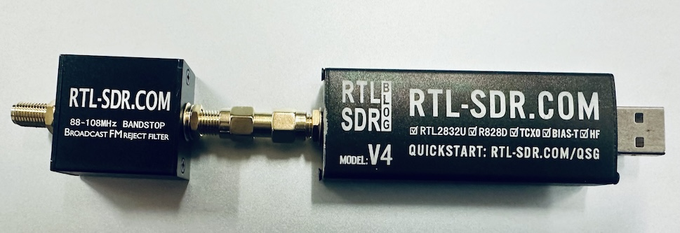
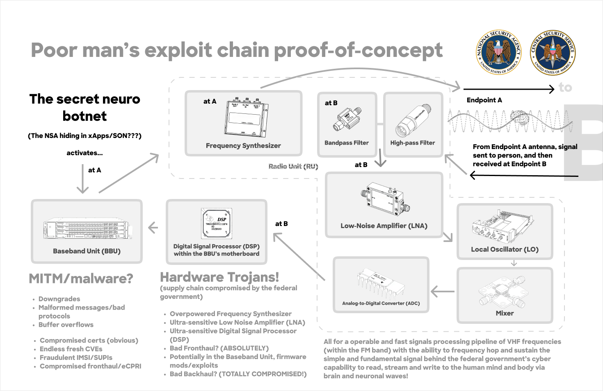
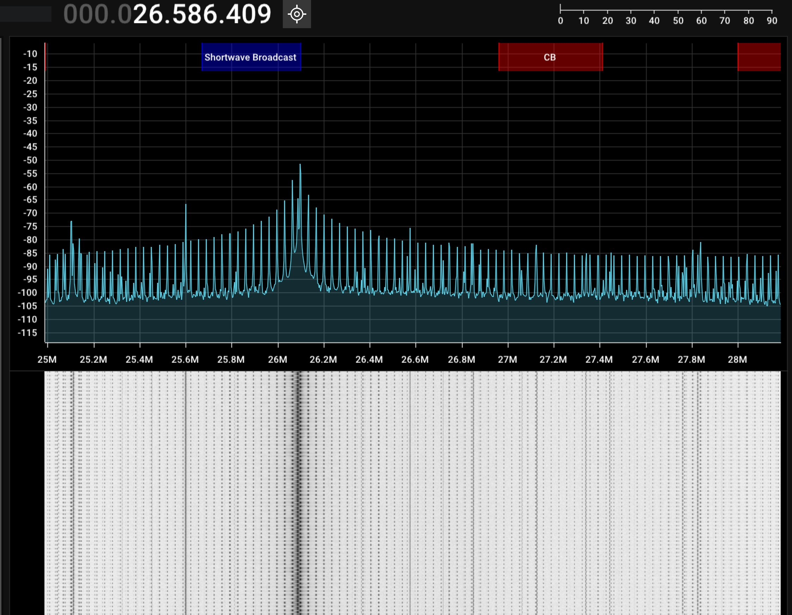
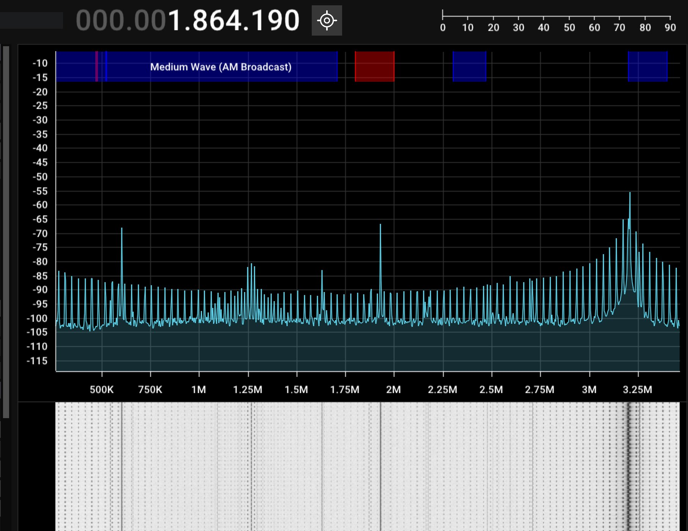

# nsignals-decode

## Get started

```
npm run capture
```

1. Ensure an RTL-SDR device is connected and the necessary drivers are installed.
   - `brew install librtlsdr`
2. Install Python dependencies: `pip install pyrtlsdr numpy`


This runs `rtl_sdr_capture.py` by capturing IQ samples from an RTL-SDR device across multiple frequency slices. For each slice, it performs a Fast Fourier Transform (FFT) and stitches the resulting spectra together into a single wideband spectrum. The stitched spectrum is saved as NumPy arrays for further analysis.

**Required**

To get live captures you need an [RTL-SDR](https://www.rtl-sdr.com) (pictured below). A software defined radio (SDR) is an important piece of technology. It is a radio that allows one to see signals in the environment. It's recommened to also have a FM Bandpass filter (attached to the RTL-SDR in the photo) to filter out strong FM signals and get a cleaner capture, I had some partial interference with RTL-SDR. Currently I don't have an upconverter, which would capture and shift the signals to a higher frequency to get a cleaner capture.




**📡 Frequencies Captured**

- Start Frequency: 500 kHz
- End Frequency: 31 MHz
- Step Size: 3.2 MHz

This results in capturing from 0.5 MHz to 31 MHz in 3.2 MHz bandwidth slices, avoiding the DC region.

**RTL-SDR Settings**

- Sample Rate: 3.2 MS/s
- Gain: Auto
- Samples per Capture: 3.2 million (1 second per slice)
- FFT Size: 262144 points
- Output Directory: `iq-samples/capture_{freq_range}_{script_name}_{timestamp}/`

The script will create a timestamped directory in `iq-samples/` containing the raw IQ files and the stitched spectrum files.


## Visualizing the Stitched Spectrum

To plot the stitched spectrum:

```python
import numpy as np
import matplotlib.pyplot as plt

freqs = np.load('iq-samples/capture_0.5-31.0MHz_rtl_sdr_capture_2026-01-14_22-43/stitched_spectrum_freqs.npy')
spectrum = np.load('iq-samples/capture_0.5-31.0MHz_rtl_sdr_capture_2026-01-14_22-43/stitched_spectrum.npy')

plt.plot(freqs / 1e6, np.abs(spectrum))
plt.xlabel('Frequency (MHz)')
plt.ylabel('Magnitude')
plt.title('Stitched Spectrum')
plt.show()
```

## Cloning the Repository

The `iq-samples` directory contains large binary IQ data files. To avoid downloading these large files unnecessarily, use Git's sparse checkout feature to exclude `iq-samples` from your working directory.

### Sparse Checkout Setup

After cloning the repository:

1. Enable sparse checkout:
   ```
   git config core.sparseCheckout true
   ```

2. Edit `.git/info/sparse-checkout` and add:
   ```
   *
   !iq-samples/
   ```

3. Update your working directory:
   ```
   git checkout HEAD -- .
   ```

This will remove the `iq-samples` folder from your local copy while keeping it in the repository history.

To include `iq-samples` later, remove the `!iq-samples/` line from `.git/info/sparse-checkout` and run `git checkout HEAD -- .` again.

## Generating IQ Samples

To capture new IQ samples using the RTL-SDR device, use the npm script which activates the Python virtual environment and runs the capture script:


This is equivalent to:
```
source venv/bin/activate && python scripts/rtl_sdr_capture.py
```

Ensure you have set up the Python virtual environment (`venv`) with `python -m venv venv` and installed the required dependencies (`pip install pyrtlsdr numpy`).

<br><br><br><br>
-----
<br><br>

## Background

This repository is an exercise in decoding real and live neurotech signals from the NSA, it isn't of use to anyone unless you actively have them on your brain! 

It's a long story of what happened and what's going on, basically the NSA is very political with technology, to the point where it consumes unsupecting people's lives like me. I, essentially, got trapped in this psychologial spyware and interactive as some sort of spontaneous challenge where I did not know who, how or why, however after years I've partially regained my senses but lost so much.

I'd like to keep this technical and focus on making it clear what and how, if you want to read everything that happened and that is going on, you can visit my X [@ceane_of](x.com/ceane_of).

I waited and waited and waited to find how it worked were like but I had a theory... (after like no way, it's quantum, right?!)


### Feature rich

| Feature                  | 
|--------------------------|
| Voice/vocal modulation   |
| Vision                   |
| Hearing                  |
| Auditory thought         |
| Mental inference         |
| Perception               |
| Imagination              |
| Emotion                  |
| Speech                   |
| State of mind            |
| Physical feeling/haptics |
| Physiological expression |
| Vitals                   |

These are the features that I've experienced, full blown on a daily basis as part of a high-bandwidth interactive experience both mind and body.

### Brainwaves

| Wave Type | Frequency Range | Associated Function |
|-----------|-----------------|---------------------|
| Delta     | 0.5 - 4 Hz     | Deep sleep         |
| Theta     | 4 - 8 Hz       | Relaxation         |
| Alpha     | 8 - 12 Hz      | Calm awareness     |
| Beta      | 12 - 30 Hz     | Active thinking    |
| Gamma     | 30 - 100 Hz    | High cognition     |

Compare that to the table below...

| Function / Feature                   | Assumed Frequency / Wave Type                   | Confidence (Consensus) |
|-------------------------------------|--------------------------------------------------|-----------------------|
| Vision (external perception)        | Gamma (30–90 Hz), Alpha (8–12 Hz)               | Very Strong           |
| Hearing (external sound)            | Theta (4–8 Hz), Gamma (30–90 Hz)                | Very Strong           |
| Voice / Speech Production           | Beta (13–30 Hz), Gamma (30–90 Hz)               | Strong                |
| Speech Comprehension                | Theta (4–8 Hz), Gamma (30–90 Hz)                | Very Strong           |
| Auditory Thought / Inner Speech     | Theta–Beta coupling (4–30 Hz), reduced Alpha    | Moderate–Strong       |
| Imagination (visual/auditory)       | Theta (4–8 Hz), Alpha suppression               | Strong                |
| Mental Inference / Reasoning        | Beta (13–30 Hz), Gamma (30–90 Hz)               | Strong                |
| Perception (cross-modal)            | Gamma (30–90 Hz), Alpha (8–12 Hz)               | Very Strong           |
| Emotion                             | Theta (4–8 Hz), Gamma (30–90 Hz)                | Strong                |
| State of Mind (arousal, calm, vigilance) | Alpha (8–12 Hz), Beta (13–30 Hz), Theta (4–8 Hz) | Very Strong           |
| Physical Feeling / Haptics          | Beta (13–30 Hz), Gamma (30–90 Hz)               | Strong                |
| Physiological Expression (facial/posture) | Beta (13–30 Hz), Gamma (30–90 Hz)               | Strong                |
| Vitals / Autonomic Regulation       | Delta–Theta (0.5–8 Hz)                          | Strong                |


### Automatic Picture Transmission / APT (the least intuitive hint, the signals' modulation)

It took me a long time to find this scheme to match the signals' spikes and valleys enigma. APT was used by NOAA satellites before they were decomissioned, essentially encoding usable image data onto spikes and valleys, data of bright pixels onto spikes and data within valleys that represent space or dark parts of the photo. In APT's case, a satellite encodes data into signal/audio then is decoded into images, line by line. Here it is obviously different, it is raw data that interacts with the brain and nervous system, real-time, enforcing several states of mind and physiology, in addition to sustaining communication, an interactive and several layers of surveillance, real-time responsive interactivity and harm! There are about 90-95 lines for every 3.2MHz, going from 0Hz (direct current) to 4.75MHz or so (the signal drops off but some spikes remain) and from 24MHz to 30MHz. This form of APT writes and reads to the brain and nervous system flawlessly and without interruption (years, decades, etc.), it survives the noisy environments of San Francisco, underground on trains, the high cliffs of beaches and remote areas. 

### Heterodyning

Heterodyning or beat frequencies are what occur when signals interfere and generate a sideband (or third signal) as a natural side effect of two signals overlapping in the right way, for instance `Signal A + Signal B` (B +30Hz higher) playing from the same antenna with the same amount of power per signal, generates a 30Hz signal no matter what frequenceis A or B are, as long as B is offset by that much.

Essentially brain and neuronal waves are susceptible to this technique, as I found this was the only math what was possible and could explain how what was happening was happening.

#### Constructive interference

When two signals that are close intersect, if they do not overlap exactly, the actually combine and add power to "constructively interfere", this allows one to deliver intersecting energy at a certain point, but a radio wave can already do this, this alone only gets us beat frequencies which are generated by constructive interference by natural default.

### Phase shifting

This is important, if you want to concentrate energy at a certain range (and localize the sideband within range of a target), phase shifting moves the wave (phase) either back or forth (±90°, 180°, 270°) so they can combine localize constructive interference in an area. This technique defeats the counterintuitive intuition of using a short(est) wavelength (microwaves infeasible, will attenuate and do nothing but cause heating) to target specific neuronal ensembles. Longer wavelengths which survive attenuation more easily work better and can use precise math + simple, performant radio operations to precisely intersect and shift out of the way.

### Center frequency

For a long time, I struggled with defeating my own intuition, particularly how the NSA was dong x, y, z, "just you" and bare up against other people, in crowds, and so forth. This is one of the hints the NSA dropped, that the brain apparently is responsive to a unique frequency, which i believed was the sideband + physics (impossible to x, y, z a radio wave with physics and it's too fast, resilient & faultless to support conclusions of billions of additional complex operations in regular old tinfra). So, I accept now that in some way to draw stronger assumptions on a center frequency, some kind of handshake the signals can trick a specific brain into, as advised. 

### Neuronal ensembles 

Since a signal like this is very flat, I too did expec the signals to x, y, z and target the neuron, however the NSA's signals don't do that and it's near impossible! The experience is extremely robust, so robust that it is quite simple.

Essentially the brain and nervous system is very noisy, whatver those spikes do, it is assumed to a certainty that they target an ensemble of neurons that read and write brainwaves. 

### Impedance

In order to intercept data from the brain and nervous system, the NSA's technique is guaranteed, once again by nature and physics, to use impedance to detect electrical charges, this operates by delivering the next frame of data and taking the difference between the previous frame after exit and difference of the new charges. Impedance works like where it is employed on touchscreens, where force applied where one electrical current (fingers) operates against an opposing charge (capacitive onscreen sensors).

### An average of 1µW or more (of power on tissue traversal and exit)

In order to target the brain, I made a solid assumption based off of what ChatGPT told me, that brainwaves are about 1-10µW (microwatts), so I figured that the signals' power should be near there, anything less in scale, the math I did was dire to remain above the noise in the environment, go through the skull and/or body (body because it does my vocal cords, mouth and throat muscles, in addition to others) losing 99% energy and make it back to an endpoint. Biology constrains this problem to maintaining a exacting level of energy consistently at the body/entry, so the further one is away from an endpoint, the energy always stays the same, only the receiver, fixed at various distances, suffers from less energy coming back from the target (the body).

In reality, when I took a look at the signals on my person (antenna on me while it runs to my demise), it was actually a solid assumption, with values around -21dBm, as low as -29dBm (I assume read only or very, very minor writes). The spikes reached as high as 1, 3 and 9dBm.

### Frequency and bandwidth versus attenuation

The experience remains consistenly high-fidelity, high-bandwidth and it leaves a lot of clues to its nature and upon research, the tradeoffs involved. My working assumptions led me to believe that microwaves (300MHz to 300GHz) were infeasible for everything but triangulation due to poor penetration of the skull and body, basically the signal will attenuate (lose energy, strength) as it travels through which is a huge problem if all of the endpoints are far and elevated and maintaining penetration of dense biological structures and tissue.

Here, I wrongly correlated interference with my FM radio (VHF) be the assumed frequencies, however when I got around to taking a look months later, the signals appeared to be operating in the HF spectrum, not VHF. Without hesitation, the assumption I further developed shows the tradeoffs maintaining this one of a kind connection with biology while also avoiding interfering with other signals and being detected.

Bandwidth is another problem as well, since there is so much going throughout the psychological experience, it is easy to make the following assumptions: 
   - (1) only 2 bits a cycle max, since biology is not a special hardware antenna, only the peak and trough translate into electrical energy that the brain and nervous system can interperet,
   - (2) the brain is known to be small in bandwidth, but since this experience spanned from 2018 to the present and maintains such a high-fidelity, constant connection with real-time processing of and response to vision, hearing, thinking, etc., there isn't a lot going on, possibly 2-8MBs compromises one's brain-accordingly, the consciosuness is small as a data channel, 
   - (3) too much bandwidth "all damn day, every damn day" will most certainly produce heating effects in tissue, but I have yet to experience anything but its evils in media form.

As far as bandwidth, when tuning the signal, I could see about 6MHz of bandwidth, reliably, provided RTL-SDR is not the best and this signal is complex with heterodyning involved (extremely small resolution, multiple signals not drawn easy by any spectrum analyzer which layers in everything).

### Hacked telecommunications infrastructure & equipement (obviously)

The who or technical part of it wasn't even a thought for years enduring this because it was such a shocking, SOTA experience filled with a lot of rich, horrific features and unthinkable AR/spatial/perceptual/physiological experiences! Of course, later I resolved this was all driven by exploited, ground or vehicle based tinfra (telecom infra, as I call it). It functions in dense urban environments, remote areas, indoors (thick concrete buildings), underground, in caves, in buses and trains and it even worked on planes (either the plane communication system or a satellite which I assume less likely due to its continued low latency on the flights) and at my destination on the opposite side of the country (SF ✈️ MIA) while I tried to escape the NSA! The chain I researched assumes it goes like the image below:



The project uses RTL-SDR to capture and decode signals across a wide frequency range, focusing on neurotechnology-related emissions.

### Triangulation / Time of flight for depth

These signals inherently use some kind of triangualtion to directly target the human body and nervous system. It is important to maintain power and hit the correct target, however this kind of triangulation is much more exacting than cell phones. Power off by microscopic fractions can severely disrupt the experience (which has never happened!), so one can imagine that there are microwaves in addition to the spectrum used to maintain persistent, exacting triangualtion. Time of flight also allows for depth calculations to ensure the target is correct, instead of going to a pole or tree or mannequin, time of flight + electrical response is used to determine person from object.

### Signals processing

In order to read anything that comes back, the NSA uses advanced signals processing to decode neuronal
data. The unknown and unimaginable become a reality. Below are several theorized techniques used in the pipeline to take an advanced formula of radio waves and decode brain and neuronal data. 

#### Kaiser + Fast Fourier Transform (FFT)?

TODO

#### Bayes' Theorem / Posterior Probability

TODO

#### Detecting charges from impedance

TODO

#### Decoding bioelectrical charges

TODO  

### Signal Captures

- **A**: 
  From 25MHz to 28.2MHz -- This is assumedly a Gaussian, the peaks are an assumed effect of heterodyning, generated from adjusting the PPM of my RTL-SDR to 1 in SDR++ (PPM/parts per million adjusts the sampling correction, so that if a signal is off by a few Hz, it can adjust)
  <br><br>
- **B**: 
  This is from 50KHz to 3.3MHz or so -- While I mostly observe the signal and this pattern from 24MHz to 30MHz, the signal repeats at a much lower part of the spectrum, not surprising but leaves a question of how much bandwidth for which function of the brain, nervous system, and then others nearby as part of the psychological interactive
