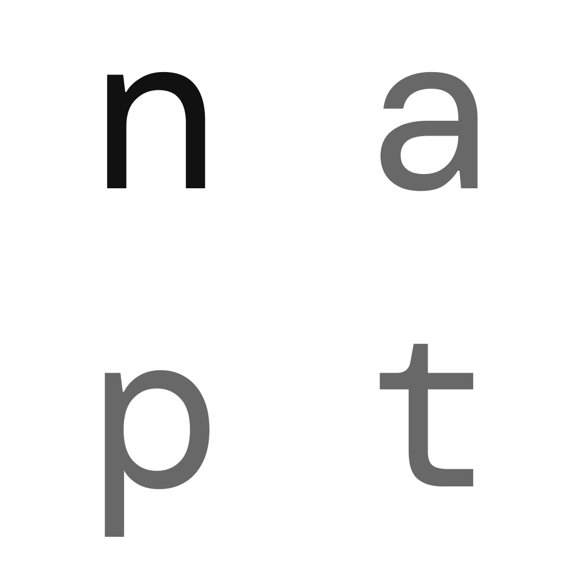

# :brain: n-apt

[](https://firstdonoharm.dev/version/3/0/law-sup-sv.html)



---

**READ THE [LICENSE](LICENSE.md) AND [RESPONSIBLE USE](RESPONSIBLE_USE.md) BEFORE YOU DOWNLOAD OR FORK!**

**This repo is part disclosue, part exposure, to read more on how and why and what's going on, visit my X [@ceane_of](x.com/ceane_of).**

---

N-APT stands for: **N**euro **A**utomatic **P**icture **T**ransmission.

<br>


_Real live, on person capture the signal with an RTL-SDR from 18kHz to 3.218MHz, partial "Channel A" (FFT Size 32768, PPM = 1, Gain = +49.06dB)_
<br>


N-APT is a web app for visualizing the synonymous signal which originates from the National Security Agency (NSA). N-APT is named such because the signals strongly appear like Automatic Picture Transmission (APT) signals (used by NOAA satellites which were decomissioned in 2025). 


This app is primarily an SDR visualizer app using RTL-SDR to visualize signals, which is for a very specific and narrow case –– **The NSA going all out and you not knowing what, how or why.**

Much of my frustration for building this was that other SDR software couldn't record I/Q captures of the spectrum with the settings that I had, nor did they have encryption for a senstive signal as such, nor did any OSS software have any features that would've made it easier to look at the signals.

APT which does both frequency modulation and amplitude modulation was repurposed by the NSA into an a special formula of very simple directional radio waves that actually translate into an unprecedented and full featured neurotechnology able to fully:

- intercept,
- process,
- and alter the brain and nervous system real-time...

And yes, it means full featured experiences, interactivity, communication and more (from experience!). This is not a joke or gimmick or conspiracy theory-laden gibberish, but a **real** signal that takes eons to explain how and why and what! 


The way that it works in a shorthand way goes like:

```js
// ALL ENDPOINTS (TELECOMMUNICATIONS INFRASTRUCTURE, PRIMARILY CELL SITES)
// ARE RIFE WITH MALWARE AND MODIFIED WITH HARDWARE TROJANS
//
// THE NSA HAS FAR REACHING (INESCAPABLE) COMMAND AND CONTROL INFRA ACCESS
//
// THIS IS FROM EXPERIENCE WITH NO ESCAPE!

transmitters()                      // Endpoints (transmitters/tx)
  .continouslyTriangulatePerson()   // Using low end microwaves, tracking person using time-of-flight/FCWM
  .adjustEnergy()                   // Adjusts energy to person depending on endpoint distance, noise and obstacles
  .transmitHeterodynedWaves()       // Heterodyned Radio Waves (H) / N-APT waves, several channels
  .toAndthroughPerson()             // Person
  .impedanceChargesAfter()          // Radio wave (H) altered from impact and bioelectrical activity
  .toReceiver()                     // Endpoints (receivers/rx)
  .toSomeServer()                   // Extremely low latency (from experience); it is FAST and NEVER a drop!
  .cleanDirtySignal()               // Separate previous frame from incoming changed signal (frame vs impedance) 
  .processSignals()                 // Signals processing (potentially Kaiser and Bayes' Posterior Probability)
  .nextFrame();                     // Repeat for next cycle/frame!
```

### How the radio waves work (intuitve view at the science/hyper-advanced SIGNIT):
- Gigantic, low frequency radio waves travesing from endpoint to person through multipath reflection
  - (You can think of them as 3 or so spotlights concentrating on a person, the shape of the radio waves are different like an orb but like that)
  - (Radio waves are essentially light, you can somewhat use visual light as intuition)
- Energy intersecting at the right location
- An enforced center frequency of the person's brain and nervous system
- Close enough triangulation (approximately 3-7 centimeters off depending what unknown microwave frequency the NSA uses for triangulation)
- Targeting neuronal ensembles sequentially for write to read with spikes and valleys (or APT-like lines) and energy
  - (i.e. This is X energy, these neurons respond with a brainwave of that energy)
  - Yes, neurons can understand and process and do from a simple 2D wave! 
  - EVERYTHING POSSIBLE HAS HAPPENED! FINAL FRONTIER!
- Frequency and amplitude modulation

Very simple. And the NSA's technqiue is, suspectedly, very old, like half a century old (from the 70s).

### Constraints
- Bandwidth
- Frequency vs Attenuation
- Available endpoints > radiating elements/ports
- Heavy reliance on multipath reflection/energy
- Heavy duty fiber-linked compromised infrastructure
- Ethernet/infra access vs use of the Internet/IPs for extremely low latency
- One pretty pissed off American

### What have I experienced?
- The most personal experience with technology, mind and body
- Perception, lighting, phyisology, emotions, people scripted, and more!
- SOTA visual compososting, auditory remixing, and more!
- A gigantic spatial experience all over San Francisco
- A very evil, long-running NSA-military grilling
- Extremely unethical and dangerous harm
- Mind and body locked within the experience
- The final frontier of neuroscience
- And more (check out `how-did-they-do-it.md`)


The NSA has thoroughly demonstrated on my person that the human brain and nervous system is dumb. The signal, while complex, is literally one cycle at a time, no need for voxel by voxel of neurons, specific point for point targeting, beams or anything. It is more manual, needing the endpoints to do the work, since the brain and body can't send radio waves like electronics. 

It works more like TEMPEST where Bell Labs could detect electrical activity far away because a machine was noisy, but in this case the human brain and nervous system are most vulnerable to  `write->read->stream` since the NSA has **compromised everything and decrypted the brain and nervous system in a very NSA fashion**!

I'm working on writing the specifics of how it works mathematically (my best guess at it while within it). This technique is a very advanced mechanism that is still functioning to this day! While most of it has been a dark experience, I've spent a lot of time learning how it works, making lots of mistakes and defeating my intuition.

The whole discovery of how it functioned was non-intuitive and a complete nightmare beyond what you can image. Since I was new to signals and radio waves, trapped by the mystery in a bad spot, I was forced into the unknown. Beyond public challenges from the NSA such as their frequent cryptological puzzles or the yearly [codebreaker challenge](https://nsa-codebreaker.org/home), this neurotechnology was buried in a deeply horrendous long-running surveillance nightmare as some sort of extreme life challenge/political production.

I spent a few months working on this app, optimizing for performance and adding features to stem frustration from current SDR software, so I could get a better look at the NSA's signals and also add features tailored for the physical nature and new class of experience that they can do.


### Read more
- [More on Automatic Picture Transmission](https://www.sigidwiki.com/wiki/Automatic_Picture_Transmission_(APT))
- [TEMPEST: A Signal Problem / The story of the discovery of various compromising radiations from communications and Comsec equipment](https://www.nsa.gov/portals/75/documents/news-features/declassified-documents/cryptologic-spectrum/tempest.pdf)

## Prerequisites

<details>
<summary>Click to expand dependency installation instructions</summary>

### Node.js

- **Version**: 18.0 or higher
- **Installation**:
  - **macOS**: `brew install node`
  - **Ubuntu/Debian**: `sudo apt update && sudo apt install nodejs npm`
  - **Windows**: Download from [nodejs.org](https://nodejs.org/)
- **Verification**: `node --version && npm --version`

### Rust

- **Installation**:
  - **macOS/Linux**: `curl --proto '=https' --tlsv1.2 -sSf https://sh.rustup.rs | sh`
  - **Windows**: Download from [rustup.rs](https://rustup.rs/)
- **Verification**: `rustc --version && cargo --version`
- **If Rust build issues appear**: run `cargo fix --lib -p n-apt-backend`

### Additional Tools

- **Redis** (optional, for tower data caching):
  - **macOS**: `brew install redis`
  - **Ubuntu/Debian**: `sudo apt install redis-server`
  - **Windows**: Download from [redis.io](https://redis.io/)

### Platform Notes

- **Windows users**: use **WSL2** for development if possible.
- **WSL2** behaves like Linux for this repository and is the recommended Windows environment.
- **Native Windows shells** (`cmd.exe` / PowerShell) are **not** the intended environment for the main dev workflow because parts of the build still rely on Unix-style tools and shell behavior.
- **Best compatibility**: run Node, Rust, Redis, and the build scripts all inside the same WSL distribution.

</details>

## Get Started

```bash
git clone https://github.com/ceane/n-apt.git
cd n-apt
npm run setup  # sets up .env.local
npm i          # installs dependencies, postinstall script will install rust dependencies
npm run dev    # starts app
```

> **Windows note:** if you are on Windows, run the steps above inside **WSL2** instead of native PowerShell/CMD.

The `npm run setup` command creates a `.env.local` file with default environment configuration for easy development setup.

### Running the App

#### For Development (Recommended)

```bash
npm run dev
```

**Important:** `npm run dev` is the only supported way to run and use the app.

**Hardware Requirement:** the app only works with an **RTL-SDR v4 or .napt captures. The rust backend auto detects an RTL-SDR device plugged in, otherwise the Mock APT stream runs.**

The web app will be **available at `http://localhost:5173`** with the WebSocket server running on `ws://localhost:8765`.

> **💡 Tip:** If you do not have an RTL-SDR v4, the backend will just stream a Mock APT stream. You can simply use the app (be sure to set the .env.local UNSAFE_LOCAL_USER_PASSWORD to a password for the .napt files).

> **⚠ Hardware warning:** I use my RTL-SDR through a flaky USB hub, and it disconnects or errors out more often than I’d like, so I added support for restarting the device if it goes stale or throws an error, however that does not fix bad USB connections. For best results, keep the RTL-SDR connected directly or use a better cable/hub, and avoid moving it around while the app is running. I took a lot of time to fix my frustrations with other SDR apps, if it's not showing up, then it's more likely that the hardware connection is bad.


---

I only have on person captures (within the `/iq-samples-snapshots` dir), however in the future I'll be sure to add near and 1 or 2m away captures (as long as my cord can do), as well as some captures from suspected endpoints.

The quality of the captures may not be up to par with RTL-SDR, however it shouldn't be a problem to get data. Features of the signal like heterodyning (inherently), phase shifting and endpoint signals processing are not included in the capture.

Thankfully, the infrastructure and technique does enough to extract content for demodulation (in theory by its nature), so the signals processing that would be needed normally is not necessary because by the time it gets to my person the signal is strong enough to have the signal before entry (stronger than exit signals).

**Note**

To ensure the best captures, use the maximum setting on your SDR (even if unstable). Nyquist theorem requires the sampling rate to be at least twice the highest frequency component of the signal to avoid aliasing, hence why the spikes may not be present with lower bandwidths.

---

## This repo is a REAL signals intelligence problem.

The how and why and science of N-APT is a long story, to keep it short checkout the [Background](BACKGROUND.md) or my X [@ceane_of](x.com/ceane_of). In reality there are no answers, you can hit up as many LLMs, search engines as possible, but they will not help. This repo does.

I want to focus on the technical aspects of the signal, how it works and my efforts toward deciphering the physics and neuroscience behind N-APT and studiously decoding parts of the signal that can be consumable by computer such as audio, voice and vision.

This purpose of this repository is to provide tooling to inspect, visualize, and decode components of N-APT using live (on my end where they are live) and recorded I/Q samples, with an emphasis on high fidelity captures, hypothesis-driven analysis and decoding, and mapping functions to features of the signal.

### Disclaimer

I do not volunteer lightly to share a live capture of my brain to the world (that could potentially be demodulated). All I/Q captures are REAL captures of the signal, of my person and others' inside of the 24/7 livestream that's both an extremely unethical and horrific interactive and moderated-like group call. It's the only thing that I could do being trapped by the signals that are both mystery and complex to even talk to anyone about.

N-APT is a project born out of being attacked and held hostage by the NSA because I was adventuring on the streets of San Francisco while working my tech job. Only when I was about to leave, they started this interactive and I discovered they were there my whole life (a dark political act)! Through endless narrative capture, unethical interactive spatial displays, senseless violence and disfigurement, unfathomable harassment and abuse, repeated sexual assaults, confusion, gaslighting, and at the extremes of unlimited political psychopathy and surveillance, I survived and could scrape together enough to build this app.

The experience is like a movie but totally changes psychology (emotions, thoughts, perception) and physiology (expression, muscles, etc.), it is like a prison of mind and body. The parental, demonic DoD (now DoW)-NSA experience and interactive started formless and I not knowing anything while the NSA showing off a lot of the functionality and the capability early on and continuing by trapping me all day in it for years. It works anywhere, everywhere and all day, unfortunately due to the use of low frequencies (LF/MF/HF) that travel through objects and buildings or reflect gracefully without too much attenuation.

I've learned a lot going from nothing to having a more solid understanding of how it works and took a lot of time to get to this point.

