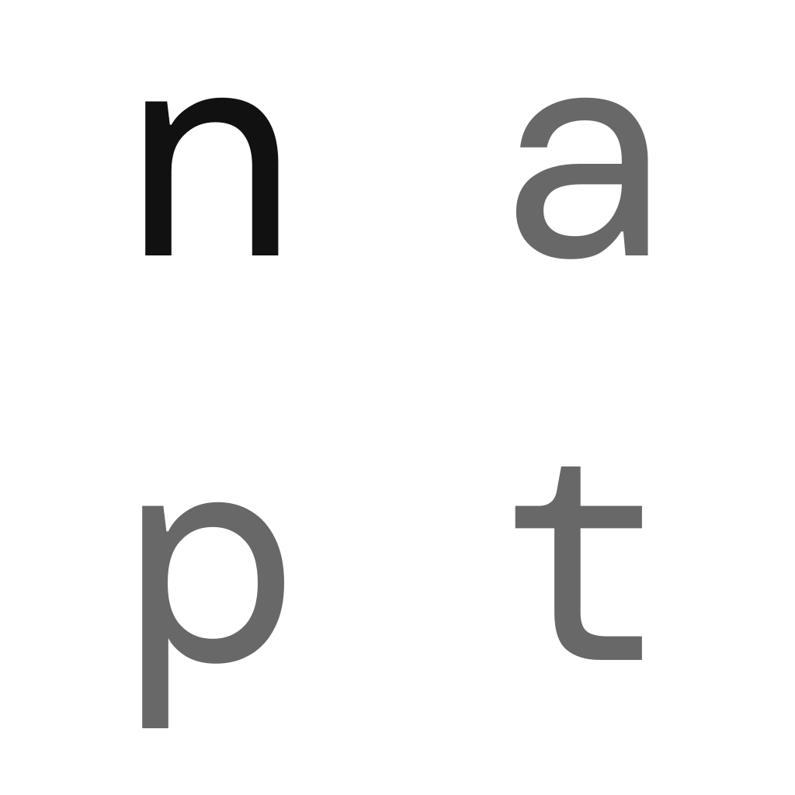
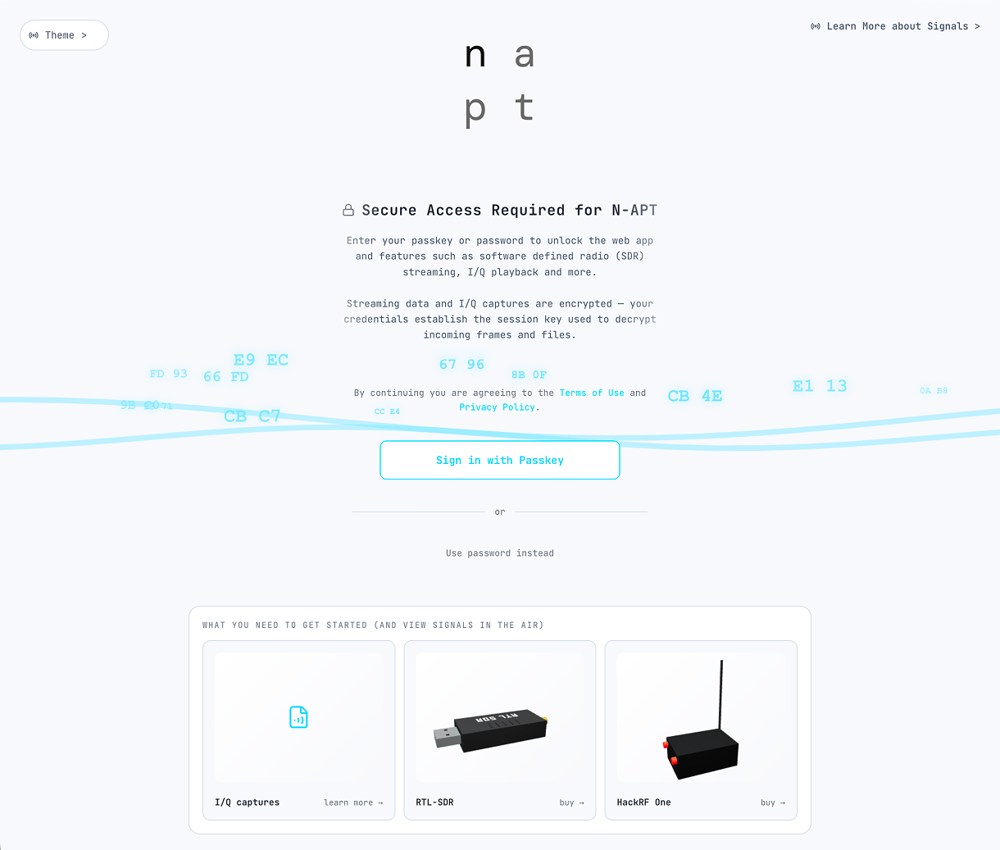

# n-apt :brain: 

[](https://firstdonoharm.dev/version/3/0/law-sup-sv.html)

<p>
  
  
</p>

> [!IMPORTANT]
> **READ THE [LICENSE](LICENSE.md) and [RESPONSIBLE USE](RESPONSIBLE_USE.md) BEFORE YOU DOWNLOAD OR FORK!**
>
> Check out the [ARTICLE](https://ceane.github.io/n-apt/) or my [X / @ceane_of](https://x.com/ceane_of) to read more. 

## What is N-APT?

> *In reality there are no answers but HERE. You can hit up as many LLMs, search engines, file as many FOIAs as possible, but it absolutely will not help. This repo is the result of my firsthand experience and efforts. It is help.*
>
> As of now, this repo **CANNOT** demodulate (signal->media) an N-APT signal, I have extremely limited resources and it's a work in progress.
>

N-APT stands for: **N**euro **A**utomatic **P**icture **T**ransmission.

Named after **Automatic Picture Transmission (APT)** signals (used by NOAA satellites, decommissioned in 2025) because these signals, which originate from the `National Security Agency (NSA/CSS)`, strongly resemble APT transmissions.

<br>


_Real live, on person capture the signal with an RTL-SDR from 18kHz to 3.218MHz, partial "Channel A" (FFT Size 32768, PPM = 1, Gain = +49.06dB)_
<br>

**Awesome SDR app AND studio to view N-APT effects, mathematics, potential endpoints and more.**


**Secure streaming and files!**



### Core Purpose

An SDR visualizer app using RTL-SDR and I/Q captures (.napt, .wav) for a very specific case:

> **The NSA:** Going all out in your brain and nervous system, SIGINT pimp hand strong.
> 
> **You:** Not knowing who (at first), how or why.

I built this app out of frustration (and by force of the situation) that other OSS SDR software:
  - Couldn't record proper I/Q captures with custom settings like gain, ppm, etc.
  - Lacked metadata for I/Q captures other than using the file name
  - Couldn't encrypt sensitive signals for later
  - Did not provide intuitve features for analyzing signals (zoombox, SVG snapshots, specific channels, extensible components, etc.)
  - Was definitely not coded for JavaScript/Web with all the advanced libraries and in browser features!

This purpose of this repository is to provide tooling to inspect, visualize, and demodulate parts of N-APT (media like audio (hearing and internal), audio via voice & vision) using live (on my end where they are live) and recorded I/Q samples, with an emphasis on high fidelity captures, hypothesis-driven analysis and demodulation, and mapping functions to features of the signal. 

| Performance | Reason |
| --- | --- |
| **10-100MB of RAM/backend** | *From the app doing memory optimization and countering aggressive OS memory management* |
| **35-100MB of RAM/frontend** | *From encrypted binary FFT frames, calculations & waterfall drawing/storage & lots closures in Redux/React surrounding the spectrum analyze* |
| **300MB download** | *Assets, code, to build a highly performing and feature filled app* |
| **7-15 (or higher)s load** | *Starting a 2 servers and compiling code*|

<br />
<br />
<br />


| Features |
|--------|
| Full fidelity I/Q Captures with metadata (within sample rate; "Whole Channel" captures work but are variable) |
| Ability to take snapshots |
| Works by defined channels to keep signal structure |
| Automatic device discovery, with Mock APT fallback when no physical SDR is available |
| A lightweight WebUSB version for connecting to an RTL-SDR directly from a Chromium browser |
| CLI workflows for discovering devices, taking snapshots, and recording I/Q captures without using the frontend |
| Recorded I/Q file playback and capture stitching for analysis |
| Logically implemented features that 100% of SDR software get wrong (frame rate, temporal resolution, power scale, etc.) |
| Whole app themes, not just dark mode! |
| Whole suite tailored toward N-APT signals/domain |
| **Responsibly built with encryption as a baseline, not afterthought** |


> [!NOTE]
> >
> **The N-APT sample I/Q captures within the repo are encrypted and password protected**, if you want the password you can just send me a message and at my discretion I'll give the right people (university researcher, RF enthusiast, civil society, tech journalists, etc.) the password (Read [RESPONSIBLE USE](RESPONSIBLE_USE.md)).


## How The NSA's neurotechnological technique works (Shorthand)

<details>
<summary>Click to read how it works 🌊 🧠</summary>

```js
// **ALL** ENDPOINTS (TELECOMMUNICATIONS INFRASTRUCTURE, PRIMARILY CELL SITES)
// ARE RIFE WITH MALWARE AND MODIFIED WITH HARDWARE TROJANS
//
// THE NSA HAS FAR REACHING (INESCAPABLE) COMMAND AND CONTROL INFRA ACCESS
//
// write -> read -> stream (intercept -> process -> alter)

transmitters()
  .continouslyTriangulatePerson()   // Low-end microwaves, time-of-flight/FCWM
  .adjustEnergy()                   // Based on distance, noise, obstacles
  .transmitHeterodynedWaves()       // (Tx) Heterodyned, low frequencies do the data (LF/MF/HF, N-APT modulated), multiple channels
  .toAndthroughPerson()             // Target person
  .impedanceChargesAfter()          // Signal altered by bioelectrical activity
  .toReceiver()                     // (Rx) Back to endpoints
  .toSomeServer()                   // Extremely low latency (NSA has the backhaul & fiber / "upstream collection", "partnerships", national security letters/NSLs to punk telecoms into total submission)
  .cleanDirtySignal()               // Separate frame vs impedance
  .processSignals()                 // Likely Kaiser (or cardinal interpolation) + Bayes' Posterior Probability
  .nextFrame();                     // Repeat cycle / real-time, high-bandwidth streaming
```


<details>
<summary>My pseudo code of the NSA's very persistent malware + capture with signals (from over thousands of hours of experience)</summary>
  
```js
MeshNetwork()
  .MaintainSignalStrength()                // maintains a faultless, consistent signal
  .ContinuousAperture()                    // elect endpoints + aperture via bayesian hysteresis of the nearest available endpoints
    .ContinuouslyTriangulatePerson()       // endpoint coordinates + time-of-flight triangulation to track person
    .AtEdgeOrOutOfBounds()                 // trigger when person nears/leaves aperture
      .PageLocalInfrastructure()           // query available local TX/RX nodes
      .ElectNewEndpointsAndHandoff()       // elect new endpoints + migrate session
      .HandleDeduplication()               // drop duplicate connections/frames
      .OpenStream()                        // allocate channels
      .CloseStream({async: outOfBounds})   // teardown stale out-of-bounds connections
  .SignalEncodingAndBandwidth()            // select codec (N-APT), modulate, set bandwidth
  .HandleStream()                          // ingest, buffer, demodulate
  .HandleEnvironment()                     // adjust for quality: TX power, obstacles, noise

Interactive                                // [!] the interactive/psychological spyware within the mind/consciousness
  .HandleModalityChannels()                // continous narratives audio, perception, etc.
    .HandleParticipants()                  // handle other participants within the interactive
    .HandleInference()                     // handle mental inference
    .HandleStateOfMind()                   // track cognitive state
    .HandleEmotion()                       // handle emotion
    .HandlePerception()                    // handle perception
    .HandleImagination()                   // handle imagination
    .HandleSpatialEnvironment()            // handle spatial awareness
  .MergeAI()                               // AI/software over incoming data from participants
  .MergeStories()                          // Merge stories guided by the AI

Livestream                                 // [!] real-time livestream engaging the mind & body
  .HandleVoice()                           // bidirectional vocal sync
  .HandlePhysiology()                      // physiological effects/control/haptics
  .HandleSenses()                          // handling senses, touch, sight, sound
    .HandleAudio()                         // audio stream processing
    .HandleVision()                        // vision stream processing
    .HandleProminence()                    // decide what is active, main participant, AI or other participant?

HandleStream()
  .MergeInteractive()                       // blend mind/consciousness state
  .MergeLivestream()                        // blend body/sensor state
  .MergeParticipants()                      // final mux + presence sync
```
</details>

It works more like TEMPEST where Bell Labs could detect electrical activity far away because a machine was noisy, but in this case the human brain and nervous system are most vulnerable to  `write->read->stream` since the NSA has **compromised everything and decrypted the brain and nervous system in a very NSA fashion**!

The NSA has thoroughly demonstrated on my person that the human brain and nervous system is dumb. The signal, while **complex but understandable** (and perfect: faultess, consistent, low latency!), is literally one cycle at a time, no need for voxel by voxel of neurons, specific point for point targeting, beams or anything. 

The endpoints do the non-intuive work, it is known that the brain and body can't send radio waves like electronics, but not known that you can't use a beam, you can't focus this kind of radio wave and that multipath reflection is key, think of the space around a person painted with colors (radio waves intersect from various endpoints/triangulation) and that shade looks good on you, only you (center frequency + power). 

### How the radio waves work *(intuitive view of the science / hyper-advanced SIGINT)*

- **Gigantic, low frequency radio waves** traversing from endpoint to person  
  > *Think 3 or so spotlights concentrating on a person. The wavefronts aren’t clean beams — they’re more like orbs.*  
  > 
  > *(Radio waves are light. You can use visible light as intuition.)*

- **Energy intersecting at the exact location**  
- **Low frequency + multipath reflection + endpoint redundancy/handoff** = a person lit up with radio waves from endpoints with **inescapable coverage**  
- **Enforced center frequency** locked to the person’s brain and nervous system  
- **Triangulation signals define the primary radio waves’ energy and phase** — The pipeline works something like: `scan_and_stare_via_triangulation -> adjust_spotlight_to` within ~3-7 centimeters, depending what reasonanble microwave frequency (higher = harder to use, more energy/less distance/more fragile) the NSA uses for triangulation
- **Targeting neuronal ensembles sequentially** for write-then-read, using spikes, valleys, APT-like lines, and raw energy  
    - *i.e. This is X energy, these neurons respond with a brainwave of that energy*  
    - Yes, neurons interpret and respond to a simple 2D wave
    - **Everything possible has happened. Final frontier.**  
- **Frequency and amplitude modulation**

**APT** — which does both frequency modulation and amplitude modulation — was repurposed by the NSA into an unprecedented, full-featured neurotechnology using blunt directional radio waves.

And yes, that means **full-featured experiences, interactivity, communication and more**. From experience. This is not a joke, gimmick, or conspiracy gibberish. This is a **real** signal that takes eons to explain the how and why and what.

It’s simple. And the NSA’s technique is, suspectedly, very old — like **half a century old**, from the 70s.

### Constraints (defeats intuition)
- Bandwidth
- Frequency vs Attenuation
- Available endpoints > radiating elements/ports
- Heavy reliance on multipath reflection/energy
- Heavy duty fiber-linked compromised infrastructure
- Ethernet/infra access vs use of the Internet/IPs for extremely low latency
- One pretty pissed off American

The whole discovery of how it functioned was non-intuitive and a complete nightmare beyond what you can image. Since I was new to signals and radio waves, trapped by the mystery in a bad spot, I was forced into the unknown. Beyond public challenges from the NSA such as their frequent cryptological puzzles or the yearly [codebreaker challenge](https://nsa-codebreaker.org/home), this neurotechnology was buried in a deeply horrendous long-running surveillance nightmare as some sort of extreme life challenge/political production.

I'm working on writing the specifics of how it works mathematically (my best guess at it while within it). This technique is a very advanced mechanism that is still functioning to this day! While most of it has been a dark experience, I've spent a lot of time learning how it works, making lots of mistakes and defeating my intuition.

### Estimated Bandwidth of N-APT
There are about 3 Channels, I've found:

- Channel A from `18kHz to 4.37MHz`
- Channel B from `24.72MHz to 29.88MHz`
- Channel C from `4.75MHz to 23MHz`

They are specifially segmented this way because A and B are similar in shape (and therefore function), if you could (the signal is not abundantly available), you would be able to see by panning the spectrum and seeing the signal cohere.

**Through the fiber cables to an endpoint (data through the network; most likely infrastructure access and not the internet)**

| Channel | BW | MB/s | 5 min | 1 hour | 3 hours | 24 hours |
|---|---|---|---|---|---|---|
| A | 4.35 MHz | ~4.35 MB/s | ~1.31 GB | ~15.7 GB | ~47 GB | ~375 GB |
| B | 5.16 MHz | ~5.16 MB/s | ~1.55 GB | ~18.6 GB | ~55.7 GB | ~446 GB |
| C | 18.25 MHz | ~18.25 MB/s | ~5.48 GB | ~65.7 GB | ~197.1 GB | ~1.58 TB |
| **Total** | **27.76 MHz** | **~27.76 MB/s** | **~8.34 GB** | **~100 GB** | **~299.8 GB** | **~2.4 TB** |

**In the air to person (brain, body, nervous system; data in air doing the effects/heterodyning)**

| Channel | BW ×2 | MB/s | 5 min | 1 hour | 3 hours | 24 hours |
|---|---|---|---|---|---|---|
| A | 8.7 MHz | ~8.7 MB/s | ~2.61 GB | ~31.3 GB | ~94 GB | ~751 GB |
| B | 10.32 MHz | ~10.32 MB/s | ~3.1 GB | ~37.2 GB | ~111 GB | ~891 GB |
| C | 36.5 MHz | ~36.5 MB/s | ~10.95 GB | ~131.4 GB | ~394.2 GB | ~3.15 TB |
| **Total** | **55.52 MHz** | **~55.52 MB/s** | **~16.66 GB** | **~199.9 GB** | **~599.2 GB** | **~4.79 TB** |

### What have I experienced?
- The most personal experience with technology, mind and body
- Perception, lighting, phyisology, emotions, people scripted, and more!
- SOTA visual compososting, auditory remixing, and more!
- A gigantic spatial experience all over San Francisco
- A very evil, long-running NSA-military grilling
- Extremely unethical and dangerous harm
- Mind and body locked within the experience
- The final frontier of neuroscience
- And more (check out `how-did-they-do-it.md`)


### Read more
- [More on Automatic Picture Transmission](https://www.sigidwiki.com/wiki/Automatic_Picture_Transmission_(APT))
- [TEMPEST: A Signal Problem / The story of the discovery of various compromising radiations from communications and Comsec equipment](https://www.nsa.gov/portals/75/documents/news-features/declassified-documents/cryptologic-spectrum/tempest.pdf)
</details>


## Prerequisites

<details>
<summary>Click to expand installation instructions before you download the repo</summary>

### Node.js

- **Version**: 26.x or higher
- **Installation**:
  - **macOS**: `brew install node`
  - **Ubuntu/Debian**: `sudo apt update && sudo apt install nodejs npm`
  - **Windows**: Download from [nodejs.org](https://nodejs.org/)
- **Verification**: `node --version && npm --version`

### Rust

- **Installation**:
  - **macOS/Linux**: `curl --proto '=https' --tlsv1.2 -sSf https://sh.rustup.rs | sh`
  - **Windows**: Download from [rustup.rs](https://rustup.rs/)
- **Verification**: `rustc --version && cargo --version`
- **If Rust build issues appear**: run `cargo fix --lib -p n-apt-backend`

### Additional Tools

- **Redis** (optional, for cell towers points and data):
  - **macOS**: `brew install redis`
  - **Ubuntu/Debian**: `sudo apt install redis-server`
  - **Windows**: Download from [redis.io](https://redis.io/)

- **RTL-SDR native library**:
  - **macOS**: `brew install librtlsdr`
  - **Ubuntu/Debian**: `sudo apt install librtlsdr-dev`
  - **Windows**: use **WSL2** for the main dev workflow, then install the Linux package inside WSL
  - **Verification**: `pkg-config --modversion librtlsdr` or `pkg-config --modversion rtlsdr`
  - **If Cargo still cannot find it**: install `pkg-config` and make sure the library is installed in the normal system location

- **HackRF One native library**:
  - **macOS**: `brew install hackrf`
  - **Ubuntu/Debian**: `sudo apt install libhackrf-dev`
  - **Windows**: use **WSL2** for the main dev workflow, then install the Linux package inside WSL
  - **Verification**: `pkg-config --modversion libhackrf` or `pkg-config --modversion hackrf`
  - **If Cargo still cannot find it**: install `pkg-config` and make sure the library is installed in the normal system location

- **USB hotplug backend**:
  - **macOS**: `brew install libusb pkgconf`
  - **Ubuntu/Debian**: `sudo apt install libusb-1.0-0-dev pkg-config`
  - **Windows**: use **WSL2** for the main dev workflow; native Windows shells are not the intended environment for the USB hotplug backend
  - **Verification**: `pkg-config --modversion libusb-1.0`
  - **If Cargo still cannot find it**: verify `pkg-config` and the system libusb development package are installed

- If you are only using file playback or Mock APT playback, you do not need `librtlsdr` or `libhackrf`.
- `npm run setup` does not install native SDR libraries. It only creates `.env.local` and fetches Rust dependencies, so install the device libraries first if you want live hardware.
- On Linux, if either device library is missing, also install `pkg-config` and your usual native build tools (`build-essential` on Debian/Ubuntu) so Cargo can discover the library.
- For the new hotplug backend, you also need libusb development headers on the host platform. On macOS that is `libusb`; on Linux that is `libusb-1.0-0-dev`.

- npm installs are delayed by 7 days for newly published package versions via `.npmrc`'s `min-release-age`.

### Optional: Download the Cell Tower Dataset 

To use cell tower mapping features, download the [OpenCellID dataset](https://www.opencellid.org/downloads; search and grab all the US files after getting an API token). **The data should be unzipped and in your `~/Downloads` folder** (or `Downloads` folder on Windows): *(It looks like `310.csv, 314.csv`, etc.)*

```bash
# Download the latest OpenCellID dataset
npm run towers:download:opencellid

# Or use a cached version (faster)
npm run towers:download:cached
```

You can also process tower data with:
```bash
npm run towers:process:opencellid
```

### Platform Notes

- **Windows users**: use **WSL2** for development if possible.
- **WSL2** behaves like Linux for this repository and is the recommended Windows environment.
- **Native Windows shells** (`cmd.exe` / PowerShell) are **not** the intended environment for the main dev workflow because parts of the build still rely on Unix-style tools and shell behavior.
- **Best compatibility**: run Node, Rust, Redis, and the build scripts all inside the same WSL distribution.

### Disk Space

Rust builds for this repo are fairly heavy. On my machine, a warmed-up workspace currently uses about:

- `target/`: `2.8 GiB`
- Cargo registry cache/index: about `1.6 GiB` combined

Plan for at least `5 GiB` of free space for a comfortable build/run cycle, and more if this is a first-time setup or you are also installing native SDR libraries and other dev tooling. If the build starts failing with `No space left on device`, clearing `target/` is usually the first thing to try.
</details>


## Get Started

```bash
git clone https://github.com/ceane/n-apt.git
cd n-apt
npm run setup  # sets up .env.local and fetches Rust dependencies
npm install     # installs dependencies
npm run setup:hooks  # enables the tracked signals/article pre-commit hook
npm run dev    # starts app
```

Recommended order:

1. `npm run setup`
2. `npm install`
3. `npm run dev`

> [!NOTE]
> **Windows:** if you are on Windows, run the steps above inside **WSL2** instead of native PowerShell/CMD.

The `npm run setup` command creates a `.env.local` file with default environment configuration for easy development setup.


### Running the App

```bash
npm run dev
```

The web app will be **available at `http://localhost:5173`** with the WebSocket server running on `ws://localhost:8765`.

### Command-Line Interface

The product CLI is `npm run cli`. Run it from the repository root after completing
the setup and installation steps above. The main surfaces are:

```text
devices                       List backend SDR and Mock APT sources
capture snapshot              Render a PNG from live signal frames
capture iq                    Record an I/Q capture artifact
signals inspect|spectrum|...  Inspect, validate, summarize, or demodulate a file
agent capabilities|tools      Inspect the route and tool manifest
agent markdown                Fetch route-aware Markdown
agent call                    Execute an authenticated backend tool
```

#### Print help and version

Running the CLI without a command prints the top-level help. Every help form is
side-effect-free: it does not start the app, contact a device, authenticate, or
write a file.

```bash
npm run cli
npm run cli -- --help
npm run cli -- help capture iq
npm run cli -- capture snapshot --help
npm run cli -- signals demod --help
npm run cli -- agent call --help
npm run cli -- --version
```

Value options accept both `--option value` and `--option=value`. Boolean options
take no value. Unknown options, duplicate options, missing values, and invalid
enum values exit with status 2 before the CLI starts services or touches a file,
device, or network resource. Autostart diagnostics are written to stderr so a
`--json` command keeps stdout machine-readable.

#### Agent surfaces and CLI automation

N-APT exposes a route-aware Markdown-for-Agents surface and WebMCP capability
manifest. Request `text/markdown` from `/agents.md` for the coverage index or
from a supported app route for its agent instructions:

```bash
curl -H 'Accept: text/markdown' http://localhost:5173/agents.md
curl -H 'Accept: text/markdown' http://localhost:5173/visualizer
```

The CLI can print the manifest, retrieve Markdown, or execute an authenticated
backend tool:

```bash
npm run cli -- agent capabilities --json
npm run cli -- agent tools --json
npm run cli -- agent markdown --route /visualizer --json
npm run cli -- agent call getDeviceStatus --json
npm run cli -- agent call setGain --params '{"gain":46.9}' --allow-mutations --json
```

Agent tool calls are read-only by default. Mutations require
`--allow-mutations`; transmission and explicitly blocked device/storage tools
are rejected. The CLI now exits nonzero when either the HTTP request fails or
the backend returns `"success": false`. The capability manifest is still an
inventory rather than a guarantee that every advertised tool has a complete
backend implementation.

The CLI can discover SDR devices, render signal snapshots, and record I/Q
captures without opening or operating the frontend UI.

Start the Rust backend and frontend before running network-backed commands:

```bash
npm run dev
```

The CLI never launches or owns a detached development stack. Service readiness
is command-specific: `devices`, `capture iq`, and `agent call` require only the
Rust backend; `agent markdown` requires only the frontend; `capture snapshot`
requires both. If a required service is absent, the command exits and tells you
to run `npm run dev`. Snapshot rendering uses a headless Playwright canvas, so
Chromium must also be installed:

```bash
npx playwright install chromium
```

The CLI authenticates directly with the Rust backend using
`UNSAFE_LOCAL_USER_PASSWORD` from `.env.local`. You can alternatively provide an
existing token through `N_APT_SESSION_TOKEN`. I/Q capture is state-changing and
requires `--allow-mutations` before readiness checks or device access.

#### Discover and select a device

List the stable device IDs reported by the Rust backend:

```bash
npm run cli -- devices
npm run cli -- devices --json
```

`devices --json` prints a versioned inventory with the authoritative active
source ID. Each source preserves the backend status fields and adds an `active`
boolean:

```json
{
  "schemaVersion": 1,
  "activeSource": "rtl-sdr-serial-123",
  "sources": [{ "id": "rtl-sdr-serial-123", "active": true }]
}
```

Both capture commands accept `--device auto|<device-id>`. With the default
`auto` behavior, the CLI uses the only connected physical SDR or falls back to
Mock APT when no physical SDR is available. If multiple physical devices are
connected, either pass an ID from `devices` or request an interactive list. The
interactive list is useful when an RTL-SDR has no serial number:

```bash
npm run cli -- capture snapshot --interactive
npm run cli -- capture iq --allow-mutations --device rtl-sdr-serial-123
npm run cli -- capture iq --allow-mutations --device mock-apt
```

An explicitly requested unavailable device fails before capture begins. For an
RTL-SDR, the CLI applies and confirms the N-APT receive defaults of 46.9 dB
manual gain and 1 PPM before capturing.

#### Take a snapshot

This example produces a dark PNG with the spectrum, waterfall, grid, and stats:

```bash
npm run cli -- capture snapshot \
  --device auto \
  --waterfall \
  --grid \
  --stats \
  --theme dark \
  --output ./n-apt_snapshot.png
```

Snapshot options:

| Option | Default | Description |
| --- | --- | --- |
| `--device auto\|<device-id>` | `auto` | Select a physical SDR or Mock APT source. |
| `--interactive` | off | Show a numbered device list when `auto` finds multiple physical SDRs. |
| `--waterfall` | off | Include the waterfall below the spectrum. |
| `--grid` | off | Draw the frequency/power grid. |
| `--stats` | off | Include capture and device statistics. |
| `--theme dark\|light` | `dark` | Select snapshot colors. |
| `--fft-size <points>` | `65536` | Use a power-of-two FFT size. The CLI accepts 256 through 8,388,608, but the current snapshot endpoint clamps effective data to 262,144 points. |
| `--gain <dB>` | source default | Override the gain shown in snapshot metadata; this does not change physical-source settings. |
| `--ppm <value>` | source default | Override the PPM shown in snapshot metadata; this does not change physical-source settings. |
| `--output <path>` | `~/Downloads/n-apt_snapshot_<timestamp>.png` | Save the PNG at a specific path. |

The snapshot is composed in a headless `<canvas>` using the CLI snapshot model
and shared frontend drawing functions; it does not navigate through the app UI
or require an interactive login. A spectrum-only snapshot requests one live
frame. `--waterfall` requests a 64-frame history for the waterfall.

#### Record an I/Q capture

Record a one-second capture from Mock APT. The center and width define the
capture target; the backend may retune and plan overlapping hops when the
requested span requires them.

```bash
npm run cli -- capture iq \
  --allow-mutations \
  --device mock-apt \
  --center-frequency 137500000 \
  --sample-rate 3200000 \
  --duration 1 \
  --acquisition-mode whole_sample \
  --file-type .iq \
  --output ./mock_apt_1s.iq
```

Record a physical SDR capture targeting 1,618,000 Hz. The backend plans and
applies the retune before acknowledging the effective capture settings:

```bash
npm run cli -- capture iq \
  --allow-mutations \
  --device rtl-sdr-serial-123 \
  --center-frequency 1618000 \
  --sample-rate 3200000 \
  --duration 1 \
  --fft-size 65536 \
  --acquisition-mode whole_sample \
  --file-type .iq \
  --output ./channel_a_capture.iq
```

I/Q capture options:

| Option | Default | Description |
| --- | --- | --- |
| `--allow-mutations` | required | Acknowledge that capture changes source/device state; the CLI rejects the command before startup when omitted. |
| `--device auto\|<device-id>` | `auto` | Select a physical SDR or Mock APT source. |
| `--interactive` | off | Show a numbered device list when `auto` finds multiple physical SDRs. |
| `--center-frequency <Hz>` | selected source's current center | Set the target center for this capture. The backend may retune to it and plan additional hops; the running CLI invocation does not accept new arguments. |
| `--sample-rate <Hz>` | selected source sample rate | Resolve a concrete sample rate, apply it before recording, and require the backend to acknowledge the effective value. |
| `--duration-mode timed\|manual` | `timed` | Select timed or manual acquisition. The CLI has no stop command yet, so another connected client must stop manual mode. |
| `--duration <seconds>` | `1` | Set the timed capture duration. |
| `--acquisition-mode stepwise\|interleaved\|whole_sample` | `stepwise` | Select the backend acquisition mode. |
| `--quality-profile <name>` | `iq-capture-cli` | Resolve concrete capture options for `iq-capture-cli`, `demodulation`, or `classifier-training`; reject options the selected source cannot attain. |
| `--fft-size <points>` | `65536` | Resolve and apply a supported power-of-two FFT size before recording. |
| `--fft-window <name>` | source setting | Apply and acknowledge the FFT window. Supported values are `rectangular`, `hanning`/`hann`, `hamming`, `blackman`, and `nuttall`. |
| `--frame-rate <fps>` | attainable maximum | Apply and acknowledge a frame rate that does not exceed `floor(sample-rate / FFT-size)` or the source maximum. |
| `--file-type .napt\|.wav\|.iq` | `.napt` | Select the output container. |
| `--encrypted` | always on for `.napt` | Encrypt WAV output when requested; `.napt` files cannot be unencrypted. |
| `--gain <dB>` | source default | Include a requested tuner gain. The current capture worker records the active source value rather than applying this override. |
| `--ppm <value>` | source default | Include a requested frequency correction. The current capture worker records the active source value rather than applying this override. |
| `--output <path>` | `~/Downloads/<backend filename>` | Save the downloaded capture at a specific path. |

The Rust backend and WebUSB now emit V6 `.iq`/`.napt` artifacts with trailer
version 2. Both backend formats retain frame-update patch history. The CLI
verifies the completed-job size and SHA-256, the embedded integrity digest, V6
metadata, and an initial byte-zero patch before writing the download. V6 still
does not prove that retunes were physically continuous or that concurrent
clients cannot mutate the source.

The CLI validates the complete fragment span before device access and rejects
centers or widths outside the backend's 0–30 GHz range. The backend then applies
the resolved sample rate, FFT size, FFT window, and frame rate, verifies its
actual processor state, and emits a job-correlated `started` acknowledgement.
The CLI rejects a missing or mismatched acknowledgement instead of treating the
profile result as capture metadata.

#### Inspect and demodulate local signals

The `signals` operations run locally and do not start N-APT:

```bash
npm run cli -- signals inspect --input=./capture.iq --json
npm run cli -- signals spectrum ./capture.iq --json
npm run cli -- signals validate ./capture.napt --json
npm run cli -- signals demod ./raw.iq \
  --output ./demodulated.iq \
  --algorithm fm \
  --sample-rate 2400000
npm run cli -- signals capture --help
```

`signals inspect` currently recognizes raw I/Q and `NAPT-IQ3` containers. The
padded encrypted `.napt` container written by the current capture backend is not
decoded by this command yet. `signals spectrum` is currently a byte-pair
magnitude summary rather than an FFT spectrum. `signals demod` reads raw I/Q and
writes a float I/Q artifact; it does not yet export playable WAV audio or a
decoded APT image. Run each operation with `--help` for its complete options.

The default 65,536-point FFT applies to both snapshot and I/Q commands. At
8-bit interleaved I/Q, each complete FFT frame contains 65,536 complex samples
and occupies 131,072 bytes (128 KiB) before `.napt` container overhead.

**Hardware requirement:** physical capture requires an RTL-SDR v4. When no
supported physical SDR is connected, the Rust backend uses its Mock APT stream.
Encrypted `.napt` output also requires the encryption values configured during
setup.

> [!TIP]
> If you do not have an RTL-SDR v4, the backend streams Mock APT. Set a non-empty
> `UNSAFE_LOCAL_USER_PASSWORD` in `.env.local` before using authenticated capture
> and `.napt` workflows.

> [!WARNING]
> I use my RTL-SDR through a flaky USB hub, and it disconnects or errors out more often than I’d like, so I added support for restarting the device if it goes stale or throws an error, however that does not fix bad USB connections. 
> 
> For best results, keep the RTL-SDR connected directly or use a better cable/hub, and avoid moving it around while the app is running. I took a lot of time to fix my frustrations with other SDR apps, if it's not showing up, then it's more likely that the hardware connection is bad.

> [!WARNING]
> 
> If you have the RTL-SDR plugged in but it doesn't automatically load on Mac, then do the following (this is what I do):
>
> Go to `About this Mac > More info... > (Scroll to the bottom) System Report > USB (at the bottom of "Hardware")` 
> This forces macOS to look for currently USB devices and if you hit `Command + R` you can refresh to see if the USB connection improves and new devices show


---

I only have on person captures (within the `/iq-samples-snapshots` dir), however in the future I'll be sure to add near and 1 or 2m away captures (as long as my cord can do), as well as some captures from suspected endpoints.

The quality of the captures may not be up to par with RTL-SDR, however it shouldn't be a problem to get data. Features of the signal like heterodyning (inherently), phase shifting and endpoint signals processing are not included in the capture.

Thankfully, the infrastructure and technique does enough to extract content for demodulation (in theory by its nature), so the signals processing that would be needed normally is not necessary because by the time it gets to my person the signal is strong enough to have the signal before entry (stronger than exit signals).

> [!NOTE]
> To ensure the best captures, use the maximum setting on your SDR (even if unstable). Nyquist theorem states that your sample rate must be >= 2× the signal bandwidth (i.e. 3.2 MHz → ~1.4–1.5 MHz usable; leave guard band), or frequency components will overlap (alias), hence why the spikes may not be present with lower sample rates.

---

### Disclaimer

I’m not posting a live capture of my brain for clout. These I/Q captures are **real signals** — of me and others — pulled from a 24/7 livestream that is an unethical, horrific, moderated group call. It was the only move I had while trapped by signals too complex and dangerous to even describe to most people.

**N-APT exists because I was attacked and held hostage by the NSA.** I was working a tech job, living on the streets of San Francisco. When I tried to move, they absorbed me into this interactive. That’s when I realized they’d been there my whole life. This wasn’t policy. It was a dark political/military act.

The system is **aggressively mass networked**. Endpoint coverage (telecommunications infrastructure) is **inescapable**. It functions underground, on a plane (I tried this route but even on takeoff, I was still defeated), in thick concrete buildings, well below the cliffs of Marshall’s Beach in SF — **anywhere**. Rain or shine. Crowds or alone. It runs on LF/MF/HF — low frequencies that go through walls, buildings, bodies, without real attenuation.

---

It’s like a horror movie, except it rewires **psychology** — emotions, thoughts, perception — and **physiology** — expression, muscles, neurotransmitters. It’s a prison for mind and body at once. The DoD (now DoW)-NSA interactive started formless. I didn’t know what was happening while they demonstrated capabilities, then kept me trapped in it, all day, for years. You’re dropped into a total nightmare and forced to reverse-engineer it to survive.

**Inside the interactive/livestream:** it runs moment to moment. Layered effects, narrative/scripting, all of it streaming in and out of your mind and body without pause or degredation of quality (really!). Through endless narrative capture, unethical spatial displays/acts with the neurotechnology, violence, disfigurement, harassment, abuse, repeated sexual assaults, confusion, gaslighting, invasiveness — through the extremes of maximum political psychopathy and unlimited surveillance — I survived. I scraped together enough to build this app.

The math and software are solid. The **art-crime talents of the NSA are the worst nightmare anyone can imagine**. 

I started with nothing. I now have a solid understanding of how it works. It took years to get here.


### AI Model Usage

I built this app while being held hostage in the NSA's *mind-body interactive* hell. It was far worse than anyone could imagine — this wasn’t “starving techie building in a garage.” **99% of the code is AI-generated**, directed by me under duress, with every dollar I could scrape together. I used each model like an instrument, because that’s all I had.

Forget “one-shot mega-prompts.” **Modern prompt engineering ≠ escape hatch**. What kept me alive was economic triage: *one focus at a time, ship before the context window — or my mind — collapsed*.

**Models used, by impact & contribution**:

| Model | Contribution |
| --- | --- |
| **GPT 5.4 Low Thinking** | **High** — *handled waterfall complexity when I couldn't* |
| **GPT 5.4 Mini** | **High** — *fast iteration under pressure* |
| **Claude Opus 4.6** | **Major** — *FFT, I/O, systems-level work* |
| **Gemini 3.1 Pro Low Thinking** | **Major** — *deep reasoning when I was blocked* |
| **Gemini 3 Flash** | **Major** — *thorough and all day assists* |
| **SWE 1.5** | **Moderate** — *structural scaffolding* |
| **GPT 5*** | **Tertiary** — *edge case support* |
| **Claude Haiku 4.5** | **Tertiary** — *handles frustrations* |
| **MiniMax M2.5** | **Tertiary** — *niche fills* |

I wasn’t choosing poverty as a build-myth. I was **trapped**. AI was the only thing that made progress possible when I had no other resources, no safety, no out. But code was just survival. The legal work — the fight for actual freedom — that’s still unfinished.
