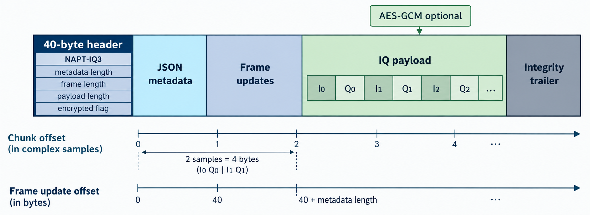
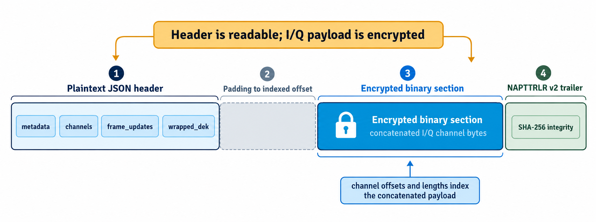
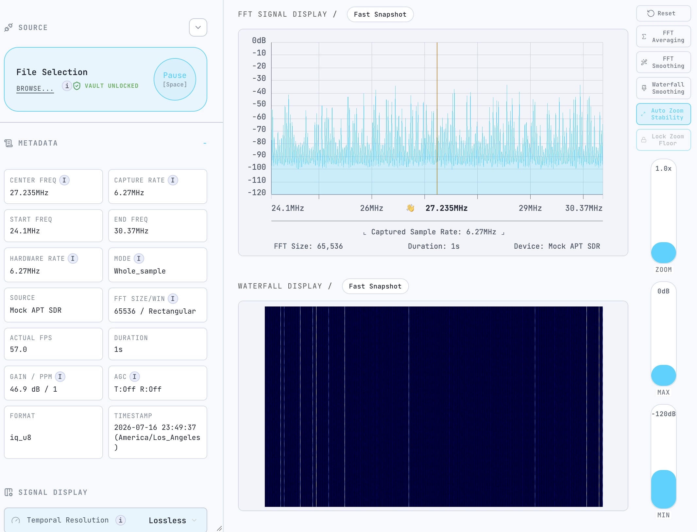

# I/Q capture file formats

There is no industry standard IQ capture format, so the app writes its own three proprietary project formats. They all store unsigned 8-bit interleaved I/Q samples and capture metadata. The extensions describe intended use and packaging; they are not general interchange standards.

| Extension | Intended use | Encryption | Recommendation |
| --- | --- | --- | --- |
| `.napt` | Sensitive N-APT captures | Required | Use for sensitive captures |
| `.iq` | Canonical project I/Q container | Optional | Preferred general-purpose format |
| `.wav` | Project I/Q carried in RIFF/WAVE | Unsupported | Compatibility option; not recommended |

> [!NOTE]
> `.wav` is not ordinary audio. The app stores I and Q as two 8-bit PCM channels and adds project metadata in a custom `nAPT` chunk. Generic audio tools may misread the samples or remove project metadata.

## At a glance

- **`.napt`:** The backend gets its encryption password from `UNSAFE_LOCAL_USER_PASSWORD` in `.env.local`. WebUSB asks for a passphrase. The binary I/Q payload is encrypted; the JSON metadata remains readable.
- **`.iq`:** Uses the app's canonical binary container. The payload can be encrypted or plaintext.
- **`.wav`:** Uses RIFF/WAVE with custom N-APT metadata and channel chunks. Encryption is not supported.

## What the files contain

All formats store the raw samples as:

```text
I0, Q0, I1, Q1, I2, Q2, ...
```

- Each value is an unsigned 8-bit integer.
- Each complex I/Q sample uses two bytes.
- The usual normalization is `(value - 128) / 127`.
- Metadata describes sample encoding, sample rates, frequency, FFT settings, device, duration, gain, PPM, and available channel information.

### Offset units

V6 has two offset units. Keep them distinct:

- **Chunk `sample_offset`:** complex samples, within a channel. One step is one I/Q pair, or two bytes.
- **Frame-update `sample_offset`:** bytes, within that channel's raw I/Q stream. It points to the first byte of the frame associated with the update.

For example, two complex samples occupy four bytes. A single-channel chunk usually starts at sample offset `0`. Multichannel files store one chunk per channel. Frame updates carry a channel index; readers route them to the relevant channel for playback.

## V6 `.iq` container



The file is laid out in this order:

1. **40-byte fixed header**
2. **UTF-8 JSON metadata**
3. **UTF-8 JSON frame-update array**
4. **Binary payload**, optionally encrypted
5. **Integrity trailer**

The header starts with the eight-byte magic `NAPT-IQ3`. It then stores four little-endian 64-bit lengths: metadata, frame updates, and payload, followed by an encrypted flag and seven reserved bytes. Use these lengths to locate each section.

### Metadata and frame updates

Metadata includes:

- `format: "iq"`, `format_version: 6`, and `interleaving: "IQ"`
- `sample_encoding`
- center, capture, and hardware sample rates
- FFT size and window, duration, frame rate, gain, and PPM
- channels, device profile, and optional location or frequency range
- `originalVersion` when a WebUSB upgrade preserves the source schema version

Each frame update has a byte `sample_offset` and `timestamp_us`. Optional fields include `kind`, `frame_sequence`, `channel`, `source_id`, `job_id`, and `patch`.

- A `Frame` entry gives the timestamp and zero-based sequence for a captured frame.
- A `PatchOptionsApplied` entry records settings effective at that boundary, such as FFT size or center frequency.
- Multiple entries can share an offset because they describe the same frame boundary.
- V6 timestamps are elapsed processing-time microseconds from capture start. They are not hardware-clock timestamps.

### Payload and encryption

The binary payload contains channel chunks. Each chunk is:

```text
u64 little-endian  complex-sample offset
u32 little-endian  channel index
u64 little-endian  data length in bytes
bytes   interleaved I/Q data
```

Optional private device metadata uses this prefix before the chunks:

```text
PMD3 || u64 little-endian JSON length || JSON bytes
```

When encryption is enabled, the complete payload, including private metadata, is encrypted together:

```text
12-byte random AES-GCM nonce || ciphertext || 16-byte authentication tag
```

The metadata and frame updates remain readable. Encrypted `.iq` uses the app's password-derived vault key. Private device metadata is only written in encrypted `.iq` files.

`metadata.sections.binary` and `metadata.sections.trailer` give absolute file offsets and lengths for their respective sections.

## V6 `.napt` container



The file contains:

1. **Plaintext UTF-8 JSON header** wrapped as `{"metadata": ...}`
2. **Padding** up to the indexed binary offset
3. **Encrypted binary section** containing the concatenated channel data
4. **Integrity trailer**

The header size is dynamic: at least 4096 bytes, rounded to a 1024-byte boundary. Readers must use `sections.binary.offset_bytes`; they should not assume every header is exactly 4096 bytes.

Channel entries describe the concatenated payload:

- `offset_iq` is a byte offset, despite the historical field name.
- `iq_length` is a byte length.
- Entries also carry sample rate, center frequency, `bins_per_frame`, and optional range and label.
- Channel lengths together must cover the complete plaintext payload.

`.napt` requires encryption. A fresh data-encryption key (DEK) encrypts the binary section with AES-GCM. The app wraps the DEK with the password-derived vault key and stores it as Base64 in `wrapped_dek`.

> [!IMPORTANT]
> The `.napt` header is plaintext. This includes capture metadata, frame timing, channel layout, and the wrapped DEK. Do not put secrets in metadata fields.

### Password source

- **Backend captures:** derive the vault key from `UNSAFE_LOCAL_USER_PASSWORD`, loaded from `.env.local`.
- **WebUSB captures:** derive the key from the passphrase entered for that capture.
- Both use the configured PBKDF2 parameters below. To share a decryption credential, the entered passphrase must match the backend password.

## WAV container

The project `.wav` writer emits RIFF/WAVE with:

- A PCM format chunk.
- A custom `nAPT` JSON metadata chunk containing channels and frame updates.
- A `data` chunk for the first channel and project-specific `nIQ1`, `nIQ2`, and later chunks for additional channels.

The WAV metadata version is currently 3. WAV captures are plaintext. Standard WAV tools may ignore extra channel chunks or remove the custom metadata. Use `.iq` for canonical project I/Q files.

## Checksum and integrity trailer

V4 introduced indexed sections and the `NAPTTRLR` trailer. Its 24-byte binary header is followed by JSON:

```text
8 bytes   NAPTTRLR magic
1 byte    trailer version (V6 writers use version 2)
7 bytes   reserved
u64 little-endian    trailer JSON length
JSON      trailer metadata
```

V6 trailer JSON includes a SHA-256 file checksum in its `integrity` record:

- Algorithm: `SHA-256`
- Scope: `file-with-integrity-digest-placeholder`
- Checksum (`digest`): 64 hexadecimal characters

The checksum covers the complete serialized file, treating the checksum field as 64 zeroes while hashing. Readers recalculate and compare it to detect file changes. It is an unkeyed checksum, not a signature, and does not prove who created the file. Encrypted payloads also have AES-GCM authentication. Plaintext `.iq` and `.wav` files have no keyed origin authentication.

The trailer stays readable when the payload is encrypted. V6 writers also include processing provenance, such as operation and tool version.

## Compatibility

- V1–V3 layouts have no indexed sections or trailer.
- V4 introduced the indexed binary and trailer sections.
- Trailer version 2 carries V5 and later SHA-256 integrity metadata.
- V6 adds per-frame `Frame` timestamps and sequences.
- Readers retain compatibility paths for older layouts and trailer versions.
- Legacy files without integrity can remain playable; their integrity status is unavailable.
- Invalid integrity is rejected unless the caller selects the recovery path where supported.
- The WebUSB encoder can preserve an older source version in `originalVersion` when upgrading `.iq` files. The backend capture writer writes new captures; it does not upgrade old files.
- `.wav` keeps its separate version-3 metadata layout.
- Do not trust the extension alone. Supported writers require `.napt` encryption, but external or malformed files still need section and metadata validation.

## Password key and online-copy salt

There are two separate salts in the app.

### Password-derived vault key

Rust and browser code use:

- PBKDF2-HMAC-SHA-256
- 100,000 iterations
- A 256-bit AES key
- Default UTF-8 salt: `n-apt-aes-salt-v1`

The backend can override the salt with `NAPT_PBKDF2_SALT`; the browser can use `VITE_PBKDF2_SALT` (or its supported fallback). Frontend and backend settings must match. This is shared configuration, not a per-file secret or a substitute for a strong password.

> [!WARNING]
> Keep a secure copy of the `UNSAFE_LOCAL_USER_PASSWORD` in a password manager. If `.env.local` is lost, you will need that password to derive the vault key and decrypt protected captures.

### Protected online copies

When the backend writes an extra protected copy for destinations such as Aspect or training-capture exports:

1. It creates a random 32-byte salt per capture job.
2. It derives a per-capture key from the vault key using HMAC-SHA-256 extract/expand and context `n-apt/capture-protection/v1`.
3. It encrypts the original file into this outer envelope:

   ```text
   NAPTENC2 || 12-byte AES-GCM nonce || ciphertext || 16-byte tag
   ```

4. It stores the salt only in Redis database 1 under `capture-protection:<jobId>`.

The salt is deliberately absent from NAPTENC2. The backend must retrieve it from Redis to derive the capture key. The outer wrapper does not change the inner `.napt`, `.iq`, or `.wav` file, including V6 metadata and checksums.

NAPTENC1 is the legacy envelope and includes its salt in the file. It does not provide the Redis-only protection described here. New Increased protection writes use NAPTENC2.

To migrate a legacy protected V6 `.iq.enc` file, run the script with its capture job ID and Redis connection:

```sh
REDIS_URL=redis://localhost:6379 node scripts/migrate_protected_captures.mjs \
  --input capture.iq.enc --job-id <job-id> --restore-missing-redis-record --dry-run
```

For a missing Redis record, `--restore-missing-redis-record` asks the script to authenticate the legacy file with its embedded salt and verify the inner V6 checksum before writing that salt with Redis `SET NX`. A dry run performs all validation but does not write Redis. Remove `--dry-run` to restore the missing record and write a separate `<input>.v2.enc` file. Add `--restore-redis-only` if you only want to restore Redis and do not want the script to create a converted file. The script does not replace or delete the source. It refuses conflicting Redis values and existing output paths, verifies the new encrypted bytes, and leaves the original recoverable if the output step fails. Only publish the converted file after reviewing it.

### Classifier archives

The offline classifier archive writer also encrypts V6 `.iq` payloads with a per-capture key derived from the vault key and a random 32-byte salt. It stores that salt in Redis DB 1 under `capture-protection:<source-capture-checksum>`; the package descriptor stores only that Redis key name. The classifier reader looks up the salt in Redis when preparing the archived capture. It does not create a replacement salt when a record is missing. Legacy globally keyed V6 `.iq` captures are rewrapped during archive, with their frame section and offsets retained and the V6 checksum recalculated and verified.

Run `node --import tsx --test test/classifier/capture-salt-backup.integration.test.mjs` for the Redis backup proof. It launches isolated disposable Redis instances over private Unix sockets, creates a real RDB backup, restores it into a fresh instance, and verifies that the restored salt decrypts a generated V6 capture byte-for-byte. It does not connect to the configured Redis server or read `.env.local`.

> [!WARNING]
> Every **Increased protection** copy uses a per-capture salt kept in Redis database 1 under `capture-protection:<jobId>`. Back up Redis data, including database 1, using the method supported by your Redis deployment. If the Redis record is lost, the corresponding NAPTENC2 files cannot be decrypted. Protect the Redis backup as sensitive key material.

For a local Redis installation, keep `.env.local` and Redis persistence files such as `.redis_data/dump.rdb` and `.redis_data/appendonlydir/*` owner-only (`600` for files, `700` for directories). Apply the same permissions to exported backups. Store a protected copy outside the machine as well; local disk permissions do not protect against disk loss.

> [!NOTE]
> `NAPTENC2` is a backend storage/export wrapper, not an inner capture format. Browser-side file playback cannot decrypt it directly. The local file worker intentionally refuses to decrypt `.enc` files; authenticated Redis-backed playback still needs a backend playback endpoint.

## Current limitations

- Frame timestamps report processing observation times, not hardware acquisition-clock ticks.
- Hardware-clock synchronization and absolute per-sample time are not encoded.
- The formats do not define compression or sparse/zero-run encoding.
- `.wav` is project-specific and is not a validated SDR interchange format.
- The SHA-256 checksum is unkeyed. It detects changes but does not establish file origin.
- Local browser playback of protected `.enc` files is not supported until an authenticated Redis-backed playback endpoint is available.

## Related implementation

- Backend writer and V6 IQ codec: `src/rs/server/utils.rs`, `src/rs/server/iq_format.rs`
- WebUSB writers and encoders: `src/ts/webusb/iqCapture.worker.ts`, `src/ts/webusb/iqCaptureFormat.ts`
- Frontend file reader: `src/ts/workers/fileWorker.ts`
- Backend cryptography and online-copy envelope: `src/rs/crypto/mod.rs`, `src/rs/server/http_endpoints.rs`
- Cross-language acceptance test: `npm run test:iq-capture:cross-language`

## File playback

The app reads capture files through the frontend worker and replays the decoded I/Q frames in the signal display. This screenshot shows file selection, metadata, and playback controls in use.


